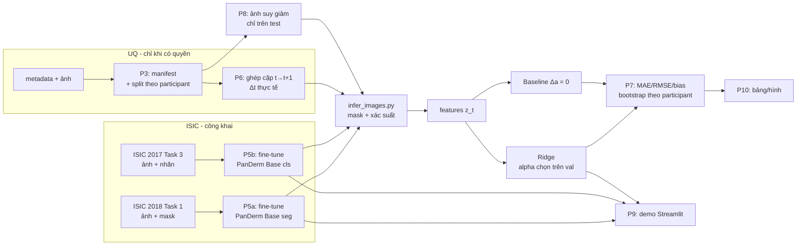

# 00 — Tổng quan và lộ trình của SV B

> Bộ hướng dẫn này dành cho **SV B (Người 2 — mô hình, pipeline, demo)** trong đề tài *"Ứng dụng PanDerm để phân đoạn tổn thương, đưa ra nhóm bệnh tham khảo và dự báo thay đổi tỷ lệ diện tích mask ở lần tái khám kế tiếp từ ảnh dermoscopy"*.
> Căn cứ: `Ke_hoach_trien_khai_NCKH_PanDerm_2_nguoi.md` (kế hoạch), `De_cuong_PanDerm_du_bao_thay_doi_ton_thuong_da.docx` (đề cương), PanDerm upstream commit `fd7a807` (17/02/2026).
> Mọi thứ chạy trên **Google Colab**; dữ liệu nằm trên **Google Drive**; code đồng bộ **Drive ↔ GitHub**.

## 1. Vai trò của SV B

| Mảng | SV B làm | SV A làm | Cùng làm |
|---|---|---|---|
| Nền tảng | Kiểm tra repo, checkpoint, môi trường, giới hạn phần cứng | Câu hỏi, tiêu chí dữ liệu, giấy phép | Khóa protocol trước khi xem test |
| Dữ liệu | Loader, kiểm tra ảnh–mask, pipeline tiền xử lý, unit test | Data dictionary, metadata, manifest, báo cáo số lượng | Kiểm tra trùng lặp, split, rò rỉ |
| Phân đoạn | Fine-tune PanDerm segmentation, lưu checkpoint/log, xuất mask | Quy trình gán mask UQ, gán mask audit | Xem lỗi trên validation và audit |
| Phân loại | **Fine-tune nhánh classification**, xuất điểm lớp | Đối chiếu nhãn, phân bố lớp | Diễn giải nhãn là tham khảo |
| Dự báo | Huấn luyện Ridge, chọn alpha, xuất dự báo | Rà soát định nghĩa cặp thời gian | Xác nhận không dùng thông tin tương lai |
| Đánh giá | Test tự động, chạy đánh giá, phân tích lỗi | Bootstrap/thống kê, tổng hợp bảng và hình | Đọc chéo kết quả |
| Bài báo/demo | Demo, mô tả triển khai, phụ lục kỹ thuật | Methods, Results, Discussion | Abstract, Introduction, CLAIM |

> ⚠️ **Lệch phân công cần SV A sửa:** đề cương (mục 7, dòng 4) ghi "Tinh chỉnh nhánh phân loại … — SV A", còn kế hoạch giao cho SV B. Nhóm đã chốt **SV B làm** theo kế hoạch; SV A cập nhật đề cương.

**Nguyên tắc kiểm tra chéo (bắt buộc):** SV A giữ bảng split và nhãn test; SV B chỉ chạy lệnh đánh giá cuối sau khi cấu hình đã khóa; mọi bảng/hình phải truy ngược được tới một script, một log và một phiên bản dữ liệu.

## 2. Lộ trình 14 tuần của SV B

| Tuần | Phase | Việc của SV B | File hướng dẫn | Runtime | Mốc bàn giao |
|---|---|---|---|---|---|
| 1 | P0 | Phản biện protocol (checklist kỹ thuật) | `P0_P1_P4_P11_vai_tro_ho_tro.md` | — | Góp ý protocol v1 |
| 1–2 | P1 | Kiểm tra cấu trúc/dung lượng UQ (khi có quyền) | `P0_P1_P4_P11_vai_tro_ho_tro.md` | NB_cpu | Bảng cấu trúc UQ |
| 1–3 | P2 | Môi trường, checkpoint, smoke test **thật**, patch Base, pilot | `P2_moi_truong_checkpoint_smoke_test.md` | NB_seg, NB_cls, NB_cpu | Log smoke test, benchmark, run card |
| 2–4 | P3 | Tải ISIC, manifest, split, unit test dữ liệu | `P3_du_lieu_manifest_split.md` | NB_cpu | Manifest + hash, test leakage = 0 |
| 3–7 | P4 | Gán độc lập một phần mask audit, tính đồng thuận | `P0_P1_P4_P11_vai_tro_ho_tro.md` | NB_cpu | Bảng Dice giữa người gán |
| 4–6 | P5a | Fine-tune segmentation ISIC 2018 Task 1 | `P5a_segmentation_isic2018.md` | NB_seg | Checkpoint chọn trên val, Dice/IoU test |
| 4–6 | P5b | Fine-tune classification ISIC 2017 Task 3 | `P5b_classification_isic2017.md` | NB_cls | Checkpoint, Macro-F1/BAcc/AUROC |
| 5–9 | P6 | Ghép cặp UQ, suy luận mask/xác suất, Ridge vs baseline | `P6_ghep_cap_va_ridge.md` | NB_seg, NB_cls, NB_cpu | `predictions_test.csv`, `ridge.joblib` |
| 3–10 | P7 | Bộ test, metric, bootstrap | `P7_kiem_thu_metrics_bootstrap.md` | NB_cpu | `forecast_metrics.json` |
| 8–10 | P8 | Robustness ảnh, Ben Graham/Gamma | `P8_robustness.md` | NB_cpu + GPU | `robustness.json` |
| 10–11 | P9 | Demo Streamlit + kiểm thử end-to-end | `P9_demo_streamlit.md` | NB_cpu (+ 2 venv) | Demo chạy được, ảnh chụp |
| 10–12 | P10 | Tái lập, bảng/hình từ script | `P10_tai_lap_hinh_bang.md` | NB_cpu | Bảng/hình bản cuối |
| 12–14 | P11 | Phụ lục kỹ thuật, tài liệu cài đặt | `P0_P1_P4_P11_vai_tro_ho_tro.md` | — | Phụ lục kỹ thuật |

## 3. Sơ đồ dòng dữ liệu



## 4. Bố cục Google Drive

```
MyDrive/NCKH_PanDerm/
├── nckh/            ← git clone repo GitHub (CODE). Push/pull ngay trong Colab
├── data/
│   ├── zips/        ← CHỈ các file GT nhỏ (mask zip, CSV nhãn). KHÔNG để zip ảnh
│   ├── manifests/   ← manifest, split, hash, CSV nhãn đã chuẩn hóa
│   └── uq/          ← chỉ khi đã có văn bản cho phép
├── checkpoints/     ← panderm_bb_data6_checkpoint-499.pth + SHA256SUMS
├── runs/<run_id>/   ← log, run card, checkpoint fine-tune, prediction, metrics
└── PanDerm/         ← (cũ) có thể xoá; P2 clone PanDerm vào /content mỗi phiên
```

**Dung lượng là ràng buộc thật.** Google Drive miễn phí có 15 GB, trong khi zip ảnh ISIC (kiểm tra ngày 05/10/2026):

| File | Dung lượng |
|---|---:|
| `ISIC2018_Task1-2_Training_Input.zip` | 11,2 GB |
| `ISIC2018_Task1-2_Test_Input.zip` | 2,4 GB |
| `ISIC2018_Task1-2_Validation_Input.zip` | 0,24 GB |
| `ISIC-2017_Training_Data.zip` | 6,2 GB |
| `ISIC-2017_Test_v2_Data.zip` | 5,8 GB |
| `ISIC-2017_Validation_Data.zip` | 0,9 GB |

→ Tổng ≈ 27 GB. **Quy tắc:** mỗi phiên Colab tải ảnh trực tiếp từ S3 của ISIC về `/content` (nhanh, ~1–3 phút/GB tùy phiên), giải nén ở `/content/data`, rồi xoá zip. Drive chỉ giữ thứ nhỏ và không tải lại được: GT, manifest, checkpoint, kết quả. Vì vậy mọi manifest lưu **đường dẫn tương đối** so với `data_root`, không lưu `/content/...`.

Đọc hàng nghìn ảnh nhỏ trực tiếp từ Drive rất chậm (FUSE). File nhỏ (CSV, checkpoint) đọc thẳng từ Drive thì không sao.

## 5. Đồng bộ Drive ↔ GitHub

### 5.1. Tạo token GitHub một lần

1. GitHub → *Settings → Developer settings → Personal access tokens → Fine-grained tokens → Generate new token*.
2. *Repository access*: **Only select repositories** → `NeuroDev204/nckh`.
3. *Permissions → Repository permissions → Contents*: **Read and write**.
4. Đặt hạn 90 ngày, copy token.
5. Trong Colab: biểu tượng 🔑 (*Secrets*) ở thanh trái → *Add new secret* → Name `GH_TOKEN`, Value = token → bật *Notebook access*.

**Không bao giờ** dán token vào cell, không `print` token, không commit file chứa token.

### 5.2. Cell đồng bộ ở đầu mỗi notebook

```python
# cell: NB_cpu
from google.colab import drive, userdata
drive.mount('/content/drive')
ROOT = '/content/drive/MyDrive/NCKH_PanDerm'
TOKEN = userdata.get('GH_TOKEN')
REPO_URL = f'https://{TOKEN}@github.com/NeuroDev204/nckh.git'
!mkdir -p {ROOT}
!test -d {ROOT}/nckh/.git || git clone -q {REPO_URL} {ROOT}/nckh
%cd {ROOT}/nckh
!git remote set-url origin {REPO_URL}
!git config user.name "NeuroDev204" && git config user.email "eduteam.hutech@gmail.com"
!git pull --rebase -q && git log --oneline -1
```

Cuối phiên:

```python
# cell: NB_cpu
%cd {ROOT}/nckh
!git status --short
!git add src scripts tests configs demo notebooks pyproject.toml .gitignore
!git commit -m "mô tả ngắn thay đổi" && git push -q
```

### 5.3. Ba quy tắc tránh xung đột

1. **Pull trước khi sửa, push ngay sau khi sửa.** GitHub là nguồn sự thật nếu bạn còn sửa ở laptop hoặc SV A cũng sửa.
2. **Chỉ một runtime commit tại một thời điểm.** Hai runtime Colab cùng ghi vào `.git` trên Drive có thể làm hỏng repo. Các runtime khác chỉ đọc code là được.
3. **Không `git add -A`/`git add .`** ở thư mục gốc repo: luôn chỉ rõ thư mục code như trên, để không bao giờ lỡ đưa ảnh hay checkpoint lên.

## 6. Ba runtime Colab

Hai nhánh PanDerm cần hai bộ phiên bản PyTorch khác nhau, nên không cài chung một môi trường.

| Notebook | Python | Dùng cho | Cài gì |
|---|---|---|---|
| `notebooks/NB_seg.ipynb` (GPU) | venv 3.10 tạo bằng `uv` tại `/content/venv_seg` | P2, P5a, P6 (mask), P8, P9 | torch 2.1.2 + torchvision 0.16.2 (cu118), mmengine 0.10.4, wheel mmcv 2.1.0, mmsegmentation 1.2.2, `segmentation/requirements.txt`, `openpyxl`, `-e nckh`. Lý do dùng torch 2.1.2 thay vì 2.2.1 của README: P2 mục 3.2 |
| `notebooks/NB_cls.ipynb` (GPU) | venv 3.10 tại `/content/venv_cls` | P2, P5b, P6 (xác suất), P8 | torch 2.4.1 + torchvision 0.19.1 + torchaudio 2.4.1 (cu118), `classification/requirements.txt`, `timm==0.9.16`, `-e nckh` |
| `notebooks/NB_cpu.ipynb` (CPU) | Python mặc định của Colab | P3, P4, P6 (Ridge), P7, P10, pytest, P9 demo | `-e nckh[demo,test]` |

Package `nckh` của nhóm **không phụ thuộc torch**, nên cài được vào cả ba môi trường mà không làm lệch phiên bản torch. Venv tạo lại mỗi phiên trên `/content` (nhanh hơn nhiều so với để trên Drive).

## 7. Nguyên tắc dữ liệu và đạo đức

- **UQ:** chỉ đưa ảnh/metadata UQ lên Drive/Colab khi đã có **văn bản** xác nhận điều khoản cho phép xử lý trên dịch vụ đám mây (xem cổng Go/No-Go trong P6). Trước đó, dùng dữ liệu UQ **giả** (`make_fake_uq.py`) để phát triển pipeline.
- **Không commit** ảnh, mask, checkpoint, token, metadata định danh. `.gitignore` (tạo ở P2) chặn sẵn các loại file này.
- **Test chỉ mở một lần**, sau khi cấu hình đã khóa và ghi vào nhật ký quyết định. Không chọn checkpoint, ngưỡng, alpha, augmentation, TTA hay tiền xử lý bằng test.
- **Không gọi output là chẩn đoán.** Nhãn là "nhóm tham khảo theo dữ liệu ISIC 2017"; dự báo là "thay đổi tỷ lệ diện tích mask trên ảnh", không phải tăng trưởng sinh học hay tiên lượng.
- **PanDerm** phát hành theo **CC BY-NC-ND 4.0**, chỉ dùng cho nghiên cứu học thuật phi thương mại, có ghi nguồn. Không chia sẻ checkpoint tinh chỉnh hay demo công khai khi chưa đọc kỹ điều khoản.
- **Không điền số kỳ vọng** vào bảng kết quả. Kết quả thấp hơn baseline vẫn là kết quả cần báo cáo.

## 8. Bản đồ file code bạn sẽ tự tạo

Bạn tự tạo toàn bộ các file dưới đây trong repo `nckh`, theo thứ tự phase. Mỗi file có mã nguồn đầy đủ trong hướng dẫn tương ứng (khối code bắt đầu bằng `# file: <đường dẫn>`).

| File | Tạo ở | Vai trò |
|---|---|---|
| `pyproject.toml`, `.gitignore` | P2 | Khai báo package `nckh`, chặn file không được commit |
| `src/nckh/paths.py`, `src/nckh/runcard.py` | P2 | Đường dẫn từ biến môi trường; run card (git commit, hash, seed, phiên bản, GPU) + CLI `python -m nckh.runcard` |
| `src/nckh/infer.py` | P2 | Suy luận PanDerm seg/cls (tiền xử lý khớp upstream), dùng lại ở P6, P8, P9 |
| `scripts/inspect_checkpoint.py`, `scripts/bench_inference.py` | P2 | Soi key checkpoint; smoke test + benchmark ms/ảnh, VRAM |
| `patches/panderm_base_seg.patch` | P2 | Sửa segmentation upstream: ViT-B, đường dẫn checkpoint, nạp an toàn, resume, không tự mở test |
| `src/nckh/isic.py`, `src/nckh/manifest.py` | P3 | Tải/giải nén ISIC, nhãn ISIC 2017; manifest, kiểm tra ảnh, split theo nhóm, kiểm tra rò rỉ |
| `scripts/prepare_isic2018.py`, `prepare_isic2017_cls.py`, `build_manifest.py`, `configs/uq_column_map.yaml` | P3 | CLI chuẩn bị dữ liệu; map cột UQ |
| `src/nckh/metrics.py`, `scripts/evaluate_seg.py` | P5a | Metric dùng chung + bootstrap theo nhóm; đánh giá seg |
| `scripts/evaluate_cls.py`, `scripts/annotator_agreement.py` | P5b / P4 | Đánh giá cls; đồng thuận người gán |
| `src/nckh/pairs.py`, `features.py`, `forecast.py` | P6 | Ghép cặp, đặc trưng tại t, Ridge + baseline, kiểm tra Δt |
| `scripts/make_fake_uq.py`, `build_pairs.py`, `infer_images.py`, `train_ridge.py` | P6 | Dữ liệu giả; pipeline dự báo |
| `scripts/evaluate_forecast.py` | P7 | Ridge vs baseline + paired bootstrap theo participant |
| `src/nckh/degrade.py`, `scripts/make_degraded.py`, `scripts/evaluate_robustness.py` | P8 | Ảnh suy giảm/tiền xử lý; so sạch vs suy giảm |
| `demo/pipeline.py`, `demo/app.py` | P9 | Demo Streamlit |
| `scripts/make_tables.py`, `scripts/make_figures.py` | P10 | Bảng/hình từ file kết quả; chọn ví dụ lỗi |
| `tests/test_*.py` (154 test) | cùng phase với module | pytest, chạy trên CPU < 1 phút |
| `notebooks/NB_seg.ipynb`, `NB_cls.ipynb`, `NB_cpu.ipynb` | P2 | Notebook mỏng: cell setup + cell gọi script |

## 9. Thứ tự đọc

`00` → `P2` → `P3` → `P5a` → `P5b` → `P6` → `P7` → `P8` → `P9` → `P10`.
Đọc `P0_P1_P4_P11_vai_tro_ho_tro.md` song song khi SV A bắt đầu các phase đó.

Mỗi file phase có cùng khung: **1. Mục tiêu và đầu vào/đầu ra · 2. Chạy ở đâu · 3. Giải thích · 4. Code · 5. Test · 6. Benchmark / đánh giá · 7. Lỗi thường gặp trên Colab · 8. Checklist bàn giao cho SV A**.

Ký hiệu trong docs:
- `# file: …` — nội dung file bạn tạo trong repo (đã được chạy pytest trước khi đưa vào docs).
- `# cell: NB_seg` / `NB_cls` / `NB_cpu` — cell dán vào notebook tương ứng.
- `> ⚠️ Chưa kiểm chứng trên GPU — xác minh trong pilot P2` — phần cần GPU/checkpoint thật, chưa chạy được khi viết docs.
