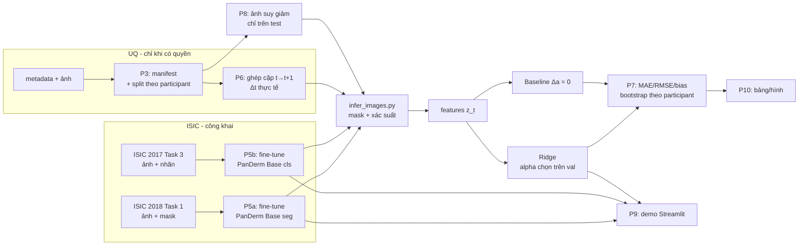

# 00 — Tổng quan và lộ trình của SV B

> Bộ hướng dẫn này dành cho **SV B (Người 2 — mô hình, pipeline, demo)** trong đề tài *"Ứng dụng PanDerm để phân đoạn tổn thương, đưa ra nhóm bệnh tham khảo và dự báo thay đổi tỷ lệ diện tích mask ở lần tái khám kế tiếp từ ảnh dermoscopy"*.
> Căn cứ: `Ke_hoach_trien_khai_NCKH_PanDerm_2_nguoi.md` (kế hoạch), `De_cuong_PanDerm_du_bao_thay_doi_ton_thuong_da.docx` (đề cương), PanDerm upstream commit `fd7a807` (17/02/2026).
> Mọi bước chạy **local trong VS Code** trên hai máy cùng bố cục thư mục: **laptop** (code, git, dữ liệu, test, đánh giá, smoke test) và **máy GPU** (fine-tune, suy luận toàn tập, robustness, demo với model thật). Code đi giữa hai máy bằng git; dữ liệu và kết quả bằng `rsync` (mục 5.2).
> Bản trước của bộ hướng dẫn chạy GPU trên Colab; từ 07/10/2026 mọi bước chạy local.

## 1. Vai trò của SV B

| Mảng | SV B làm | SV A làm | Cùng làm |
|---|---|---|---|
| Nền tảng | Kiểm tra repo, checkpoint, môi trường, giới hạn phần cứng | Câu hỏi, tiêu chí dữ liệu, giấy phép | Khóa protocol trước khi xem test |
| Dữ liệu | Loader, kiểm tra ảnh–mask, pipeline tiền xử lý, unit test | Data dictionary, metadata, manifest, báo cáo số lượng | Kiểm tra trùng lặp, split, rò rỉ |
| Phân đoạn | Fine-tune PanDerm segmentation, lưu checkpoint/log, xuất mask | Quy trình gán mask UQ, gán mask audit | Xem lỗi trên validation và audit |
| Phân loại | **Fine-tune nhánh classification**, xuất điểm lớp | Đối chiếu nhãn, phân bố lớp | Diễn giải nhãn là tham khảo |
| Dự báo | Huấn luyện Ridge, chọn alpha, xuất dự báo | Rà soát định nghĩa cặp thời gian | Xác nhận không dùng thông tin tương lai |
| Đánh giá | Test tự động, chạy đánh giá, phân tích lỗi | Bootstrap/thống kê, tổng hợp bảng và hình | Đọc chéo kết quả |
| Bài báo/demo | Demo, mô tả triển khai, phụ lục kỹ thuật | Methods, Results, Discussion | Abstract, Introduction, CLAIM |

> ⚠️ **Lệch phân công cần SV A sửa:** đề cương (mục 7, dòng 4) ghi "Tinh chỉnh nhánh phân loại … — SV A", còn kế hoạch giao cho SV B. Nhóm đã chốt **SV B làm** theo kế hoạch; SV A cập nhật đề cương.

**Nguyên tắc kiểm tra chéo (bắt buộc):** SV A giữ bảng split và nhãn test; SV B chỉ chạy lệnh đánh giá cuối sau khi cấu hình đã khóa; mọi bảng/hình phải truy ngược được tới một script, một log và một phiên bản dữ liệu.

## 2. Lộ trình 14 tuần của SV B

| Tuần | Phase | Việc của SV B | File hướng dẫn | Chạy ở | Mốc bàn giao |
|---|---|---|---|---|---|
| 1 | P0 | Phản biện protocol (checklist kỹ thuật) | `P0_P1_P4_P11_vai_tro_ho_tro.md` | — | Góp ý protocol v1 |
| 1–2 | P1 | Kiểm tra cấu trúc/dung lượng UQ (khi có quyền) | `P0_P1_P4_P11_vai_tro_ho_tro.md` | Laptop | Bảng cấu trúc UQ |
| 1–3 | P2 | Môi trường, checkpoint, smoke test **thật**, patch Base, pilot | `P2_moi_truong_checkpoint_smoke_test.md` | Laptop (smoke test) + máy GPU | Log smoke test, benchmark, run card |
| 2–4 | P3 | Tải ISIC, manifest, split, unit test dữ liệu | `P3_du_lieu_manifest_split.md` | Laptop | Manifest + hash, test leakage = 0 |
| 3–7 | P4 | Gán độc lập một phần mask audit, tính đồng thuận | `P0_P1_P4_P11_vai_tro_ho_tro.md` | Laptop | Bảng Dice giữa người gán |
| 4–6 | P5a | Fine-tune segmentation ISIC 2018 Task 1 | `P5a_segmentation_isic2018.md` | Máy GPU (venv_seg) | Checkpoint chọn trên val, Dice/IoU test |
| 4–6 | P5b | Fine-tune classification ISIC 2017 Task 3 | `P5b_classification_isic2017.md` | Máy GPU (venv_cls) | Checkpoint, Macro-F1/BAcc/AUROC |
| 5–9 | P6 | Ghép cặp UQ, suy luận mask/xác suất, Ridge vs baseline | `P6_ghep_cap_va_ridge.md` | Máy GPU (suy luận) + .venv (ghép cặp, Ridge) | `predictions_test.csv`, `ridge.joblib` |
| 3–10 | P7 | Bộ test, metric, bootstrap | `P7_kiem_thu_metrics_bootstrap.md` | Laptop | `forecast_metrics.json` |
| 8–10 | P8 | Robustness ảnh, Ben Graham/Gamma | `P8_robustness.md` | Máy GPU (suy giảm + suy luận) + .venv (forecast) | `robustness.json` |
| 10–11 | P9 | Demo Streamlit + kiểm thử end-to-end | `P9_demo_streamlit.md` | Laptop (chế độ giả) / máy GPU (model thật) | Demo chạy được, ảnh chụp |
| 10–12 | P10 | Tái lập, bảng/hình từ script | `P10_tai_lap_hinh_bang.md` | Laptop | Bảng/hình bản cuối |
| 12–14 | P11 | Phụ lục kỹ thuật, tài liệu cài đặt | `P0_P1_P4_P11_vai_tro_ho_tro.md` | — | Phụ lục kỹ thuật |

## 3. Sơ đồ dòng dữ liệu



## 4. Bố cục thư mục trên mỗi máy

```
~/Documents/nckh/               ← <repo>: git clone repo. Sửa, commit, push tại đây. Có .venv (CPU)
~/nckh_root/                    ← NCKH_ROOT
├── checkpoints/                ← panderm_bb_data6_checkpoint-499.pth + SHA256SUMS
├── data/
│   ├── manifests/              ← manifest, split, hash
│   └── uq/                     ← chỉ khi đã có văn bản cho phép (P6 mục 3.1)
└── runs/<run_id>/              ← log, run card, checkpoint fine-tune, prediction
~/nckh_data/                    ← NCKH_LOCAL_DATA: ảnh ISIC giải nén, smoke/ (P2), degraded/ (P8)
~/PanDerm/                      ← upstream fd7a807 + patch (P2)
~/venvs/venv_seg/               ← Python 3.10 cho nhánh segmentation (P2 mục 4.4)
~/venvs/venv_cls/               ← Python 3.10 cho nhánh classification (P2 mục 4.10)
```

Laptop và máy GPU có cùng bố cục. `nckh.paths` mặc định trỏ `~/nckh_root` và `~/nckh_data`, chỉ đặt `NCKH_ROOT`/`NCKH_LOCAL_DATA` khi muốn để chỗ khác. `<repo>` trong docs là `~/Documents/nckh`.

**Dung lượng** zip ảnh ISIC (kiểm tra ngày 05/10/2026):

| File | Dung lượng |
|---|---:|
| `ISIC2018_Task1-2_Training_Input.zip` | 11,2 GB |
| `ISIC2018_Task1-2_Test_Input.zip` | 2,4 GB |
| `ISIC2018_Task1-2_Validation_Input.zip` | 0,24 GB |
| `ISIC-2017_Training_Data.zip` | 6,2 GB |
| `ISIC-2017_Test_v2_Data.zip` | 5,8 GB |
| `ISIC-2017_Validation_Data.zip` | 0,9 GB |

→ Tổng ≈ 27 GB zip; mỗi máy tải một lần vào `~/nckh_data` (zip bị xoá sau khi giải nén). Manifest lưu **đường dẫn tương đối** so với `data_root` + SHA-256, nên cùng manifest dùng được trên cả hai máy.

## 5. Đồng bộ giữa hai máy

### 5.1. Code (git)

Mọi `git add/commit/push` làm trong VS Code. Trên máy kia, `git pull` trước khi chạy.

```bash
# terminal (máy local)
cd ~/Documents/nckh
git pull --rebase
git add src scripts tests configs demo notebooks patches pyproject.toml .gitignore
git commit -m "mô tả ngắn thay đổi" && git push
```

### 5.2. Chuyển sang máy GPU

Code: `git clone`/`git pull` repo trên máy GPU. Dữ liệu và kết quả: chép nguyên hai thư mục, hoặc tải lại bằng lệnh ở P2 mục 4.3 và P3.

```bash
# terminal (laptop, .venv)
rsync -a --info=progress2 ~/nckh_root ~/nckh_data <user>@<máy-gpu>:~/
```

Sau đó làm mục 6b trên máy GPU. Chép kết quả về laptop theo chiều ngược lại cho từng `~/nckh_root/runs/<run_id>`; thêm `--exclude '*.ckpt' --exclude '*.pth'` nếu không cần checkpoint:

```bash
# terminal (laptop, .venv)
rsync -a --info=progress2 --exclude '*.ckpt' --exclude '*.pth' <user>@<máy-gpu>:~/nckh_root/runs/<run_id> ~/nckh_root/runs/
```

### 5.3. Ba quy tắc tránh xung đột

1. **Push trước khi đổi máy.** Máy kia chỉ thấy code đã push.
2. **Không train cùng một `run_id` trên hai máy.**
3. **Không `git add -A`/`git add .`**: luôn chỉ rõ thư mục code như trên, để không bao giờ lỡ đưa ảnh hay checkpoint lên.

## 6. Môi trường: ba kernel

Hai nhánh PanDerm cần hai bộ phiên bản PyTorch khác nhau, nên không cài chung một môi trường. Mỗi môi trường cài một lần trên mỗi máy và có `ipykernel`, nên chọn thẳng làm kernel notebook.

| Notebook | Kernel / Python | Dùng cho | Cài gì |
|---|---|---|---|
| `notebooks/nb_cpu.ipynb` | `<repo>/.venv`, 3.10 (`uv`) | P1, P3, P4, P6 (ghép cặp, Ridge), P7, P8 (forecast), P9 (chế độ giả), P10, pytest | `-e .[demo,test]`, `ipykernel`, torch 2.4.1 **CPU** (cho `test_infer.py`, `test_bench.py`) |
| `notebooks/nb_seg.ipynb` | `~/venvs/venv_seg`, 3.10 (`uv`) | P2, P5a, P6 (mask), P8, P9 (model thật) | torch 2.1.2 + torchvision 0.16.2 (cu118), mmengine 0.10.4, wheel mmcv 2.1.0, mmsegmentation 1.2.2, `segmentation/requirements.txt`, `openpyxl`, `ipykernel`, `-e nckh`. Lý do dùng torch 2.1.2 thay vì 2.2.1 của README: P2 mục 3.2 |
| `notebooks/nb_cls.ipynb` | `~/venvs/venv_cls`, 3.10 (`uv`) | P2, P5b, P6 (xác suất), P8 | torch 2.4.1 + torchvision 0.19.1 + torchaudio 2.4.1 (cu118), `classification/requirements.txt`, `timm==0.9.16`, `ipykernel`, `-e nckh` |

Package `nckh` của nhóm **không phụ thuộc torch**, nên cài được vào cả ba môi trường mà không làm lệch phiên bản torch. Logic nằm trong `src/` và `scripts/`; notebook chỉ để xem kết quả. Lệnh train/suy luận dài chạy trong `tmux` ở terminal, để không mất khi đóng VS Code.

## 6b. Cài đặt mỗi máy (một lần)

1. Cài VS Code và 2 extension: **Python** (`ms-python.python`), **Jupyter** (`ms-toolsai.jupyter`).
2. Cài công cụ và tạo môi trường. Lần đầu, `pyproject.toml` chưa có (tạo ở P2 mục 4.2): thay dòng `uv pip install -e ".[demo,test]" ipykernel` bằng `uv pip install ipykernel`, rồi chạy lại dòng gốc sau khi tạo file.

```bash
# terminal (máy local)
sudo apt install -y git tmux
curl -LsSf https://astral.sh/uv/install.sh | sh
git clone https://github.com/NeuroDev204/nckh.git ~/Documents/nckh   # = <repo>
cd ~/Documents/nckh
uv venv .venv --python 3.10
source .venv/bin/activate
uv pip install -e ".[demo,test]" ipykernel
uv pip install torch==2.4.1 torchvision==0.19.1 --index-url https://download.pytorch.org/whl/cpu
mkdir -p ~/nckh_root/{checkpoints,data/manifests,runs} ~/nckh_data ~/venvs
```

Nếu clone repo chỗ khác `~/Documents/nckh`, thay đường dẫn này trong mọi lệnh và biến `REPO` của notebook.

3. Trong VS Code: *File → Open Folder* → `<repo>`. Mở `notebooks/nb_cpu.ipynb` → *Select Kernel → Python Environments → .venv*.
4. Máy GPU: `nvidia-smi` phải chạy được (driver NVIDIA ≥ 520 cho wheel cu118) trước khi làm P2 mục 4.4. Rồi dựng `venv_seg` (P2 mục 4.4) và `venv_cls` (P2 mục 4.10).

## 7. Nguyên tắc dữ liệu và đạo đức

- **UQ:** chỉ đưa ảnh/metadata UQ vào `~/nckh_root/data/uq` khi đã có **văn bản** xác nhận điều khoản cho phép lưu và xử lý trên máy của thành viên nhóm (xem cổng Go/No-Go trong P6), và chỉ trên những máy được ghi trong văn bản đó. Trước đó, dùng dữ liệu UQ **giả** (`make_fake_uq.py`) để phát triển pipeline. Không tải UQ lên dịch vụ đám mây.
- **Không commit** ảnh, mask, checkpoint, token, metadata định danh. `.gitignore` (tạo ở P2) chặn sẵn các loại file này.
- **Test chỉ mở một lần**, sau khi cấu hình đã khóa và ghi vào nhật ký quyết định. Không chọn checkpoint, ngưỡng, alpha, augmentation, TTA hay tiền xử lý bằng test.
- **Không gọi output là chẩn đoán.** Nhãn là "nhóm tham khảo theo dữ liệu ISIC 2017"; dự báo là "thay đổi tỷ lệ diện tích mask trên ảnh", không phải tăng trưởng sinh học hay tiên lượng.
- **PanDerm** phát hành theo **CC BY-NC-ND 4.0**, chỉ dùng cho nghiên cứu học thuật phi thương mại, có ghi nguồn. Không chia sẻ checkpoint tinh chỉnh hay demo công khai khi chưa đọc kỹ điều khoản.
- **Không điền số kỳ vọng** vào bảng kết quả. Kết quả thấp hơn baseline vẫn là kết quả cần báo cáo.

## 8. Bản đồ file code bạn sẽ tự tạo

Bạn tự tạo toàn bộ các file dưới đây **trên máy**, trong repo `nckh`, theo thứ tự phase. Mỗi file có mã nguồn đầy đủ trong hướng dẫn tương ứng (khối code bắt đầu bằng `# file: <đường dẫn>`, phía trên có dòng 📁 ghi vị trí).

| File | Tạo ở | Vị trí tạo | Vai trò |
|---|---|---|---|
| `pyproject.toml`, `.gitignore` | P2 | Máy: `<repo>/pyproject.toml`, `<repo>/.gitignore` | Khai báo package `nckh`, chặn file không được commit |
| `src/nckh/paths.py`, `src/nckh/runcard.py` | P2 | Máy: `<repo>/src/nckh/paths.py`, `<repo>/src/nckh/runcard.py` | Đường dẫn từ biến môi trường; run card (git commit, hash, seed, phiên bản, GPU) + CLI `python -m nckh.runcard` |
| `src/nckh/infer.py` | P2 | Máy: `<repo>/src/nckh/infer.py` | Suy luận PanDerm seg/cls (tiền xử lý khớp upstream), dùng lại ở P6, P8, P9 |
| `scripts/inspect_checkpoint.py`, `scripts/bench_inference.py` | P2 | Máy: `<repo>/scripts/inspect_checkpoint.py`, `<repo>/scripts/bench_inference.py` | Soi key checkpoint; smoke test + benchmark ms/ảnh, VRAM |
| `patches/panderm_base_seg.patch` | P2 | Máy: `<repo>/patches/panderm_base_seg.patch` | Sửa segmentation upstream: ViT-B, đường dẫn checkpoint, nạp an toàn, resume, không tự mở test |
| `src/nckh/isic.py`, `src/nckh/manifest.py` | P3 | Máy: `<repo>/src/nckh/isic.py`, `<repo>/src/nckh/manifest.py` | Tải/giải nén ISIC, nhãn ISIC 2017; manifest, kiểm tra ảnh, split theo nhóm, kiểm tra rò rỉ |
| `scripts/prepare_isic2018.py`, `prepare_isic2017_cls.py`, `build_manifest.py`, `configs/uq_column_map.yaml` | P3 | Máy: `<repo>/scripts/…`, `<repo>/configs/uq_column_map.yaml` | CLI chuẩn bị dữ liệu; map cột UQ |
| `src/nckh/metrics.py`, `scripts/evaluate_seg.py` | P5a | Máy: `<repo>/src/nckh/metrics.py`, `<repo>/scripts/evaluate_seg.py` | Metric dùng chung + bootstrap theo nhóm; đánh giá seg |
| `scripts/evaluate_cls.py`, `scripts/annotator_agreement.py` | P5b / P4 | Máy: `<repo>/scripts/evaluate_cls.py`, `<repo>/scripts/annotator_agreement.py` | Đánh giá cls; đồng thuận người gán |
| `src/nckh/pairs.py`, `features.py`, `forecast.py` | P6 | Máy: `<repo>/src/nckh/pairs.py`, `features.py`, `forecast.py` | Ghép cặp, đặc trưng tại t, Ridge + baseline, kiểm tra Δt |
| `scripts/make_fake_uq.py`, `build_pairs.py`, `infer_images.py`, `train_ridge.py` | P6 | Máy: `<repo>/scripts/…` | Dữ liệu giả; pipeline dự báo |
| `scripts/evaluate_forecast.py` | P7 | Máy: `<repo>/scripts/evaluate_forecast.py` | Ridge vs baseline + paired bootstrap theo participant |
| `src/nckh/degrade.py`, `scripts/make_degraded.py`, `scripts/evaluate_robustness.py` | P8 | Máy: `<repo>/src/nckh/degrade.py`, `<repo>/scripts/…` | Ảnh suy giảm/tiền xử lý; so sạch vs suy giảm |
| `demo/pipeline.py`, `demo/app.py` | P9 | Máy: `<repo>/demo/pipeline.py`, `<repo>/demo/app.py` | Demo Streamlit |
| `scripts/make_tables.py`, `scripts/make_figures.py` | P10 | Máy: `<repo>/scripts/make_tables.py`, `<repo>/scripts/make_figures.py` | Bảng/hình từ file kết quả; chọn ví dụ lỗi |
| `tests/test_*.py` (156 test) | cùng phase với module | Máy: `<repo>/tests/` | pytest, chạy trên CPU < 1 phút |
| `notebooks/nb_seg.ipynb`, `nb_cls.ipynb`, `nb_cpu.ipynb` | P2 | Máy: `<repo>/notebooks/`, kernel venv tương ứng (mục 6) | Notebook mỏng: cell setup + cell gọi script, xem kết quả |

Ngoài repo (không commit): `~/PanDerm` (upstream + patch), `~/venvs/venv_seg`, `~/venvs/venv_cls` — dựng ở P2.

Cây thư mục repo khi xong:

```
<repo>/
├── pyproject.toml  .gitignore
├── src/nckh/   __init__.py paths.py runcard.py infer.py isic.py manifest.py metrics.py
│               pairs.py features.py forecast.py degrade.py
├── scripts/    inspect_checkpoint.py bench_inference.py prepare_isic2018.py prepare_isic2017_cls.py
│               build_manifest.py evaluate_seg.py evaluate_cls.py annotator_agreement.py make_fake_uq.py
│               build_pairs.py infer_images.py train_ridge.py evaluate_forecast.py make_degraded.py
│               evaluate_robustness.py make_tables.py make_figures.py
├── configs/    uq_column_map.yaml
├── patches/    panderm_base_seg.patch
├── demo/       pipeline.py app.py
├── tests/      test_paths_runcard.py test_inspect_checkpoint.py test_infer.py test_bench.py test_prepare.py
│               test_manifest.py test_metrics.py test_eval_cls_agreement.py test_pairs.py test_features.py
│               test_forecast.py test_pipeline_fake.py test_evaluate_forecast.py test_degrade.py
│               test_robustness.py test_demo_pipeline.py test_tables_figures.py
└── notebooks/  nb_cpu.ipynb nb_seg.ipynb nb_cls.ipynb
```

## 9. Thứ tự đọc

`00` → `P2` → `P3` → `P5a` → `P5b` → `P6` → `P7` → `P8` → `P9` → `P10`.
Đọc `P0_P1_P4_P11_vai_tro_ho_tro.md` song song khi SV A bắt đầu các phase đó.

Mỗi file phase có cùng khung: **1. Mục tiêu và đầu vào/đầu ra · 2. Chạy ở đâu · 3. Giải thích · 4. Code · 5. Test · 6. Benchmark / đánh giá · 7. Lỗi thường gặp (máy local) · 8. Checklist bàn giao cho SV A**.

Ký hiệu trong docs:
- `# file: …` — nội dung file bạn tạo trong repo (đã được chạy pytest trước khi đưa vào docs).
- `📁 **Tạo trên máy cá nhân:** <repo>/…` — vị trí file bạn tạo (ngay trên khối `# file:`).
- `# cell: nb_cpu` — cell dán vào `nb_cpu`, kernel `.venv`.
- `# cell: nb_seg` / `# cell: nb_cls` — cell dán vào notebook tương ứng, kernel `~/venvs/venv_seg` / `~/venvs/venv_cls`.
- `# terminal (laptop, .venv)` — lệnh chạy trong terminal VS Code ở laptop, Python của `.venv`.
- `# terminal (máy GPU, venv_seg)` / `# terminal (máy GPU, venv_cls)` / `# terminal (máy GPU, .venv)` — lệnh chạy ở máy GPU với Python tương ứng.
- `# terminal (máy local)` — lệnh chạy được trên cả hai máy (cài đặt, tải dữ liệu, git).
- `> ⚠️ Chưa kiểm chứng trên GPU — xác minh trong pilot P2` — phần cần GPU/checkpoint thật, chưa chạy được khi viết docs.
