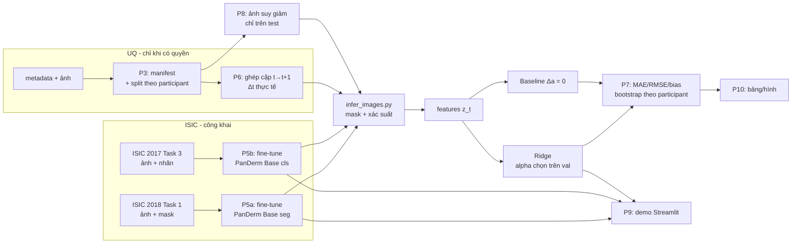

# 00 — Tổng quan và lộ trình của SV B

> Bộ hướng dẫn này dành cho **SV B (Người 2 — mô hình, pipeline, demo)** trong đề tài *"Ứng dụng PanDerm để phân đoạn tổn thương, đưa ra nhóm bệnh tham khảo và dự báo thay đổi tỷ lệ diện tích mask ở lần tái khám kế tiếp từ ảnh dermoscopy"*.
> Căn cứ: `Ke_hoach_trien_khai_NCKH_PanDerm_2_nguoi.md` (kế hoạch), `De_cuong_PanDerm_du_bao_thay_doi_ton_thuong_da.docx` (đề cương), PanDerm upstream commit `fd7a807` (17/02/2026).
> Code, git, dữ liệu, test, đánh giá và demo chạy **trên máy cá nhân trong VS Code**. Việc train/chạy model chạy trên **kernel Colab nối từ VS Code bằng extension Google Colab** (không dùng bản web). **Google Drive** là nơi trung chuyển file bền giữa hai bên, đồng bộ bằng `rclone`.

## 1. Vai trò của SV B

| Mảng | SV B làm | SV A làm | Cùng làm |
|---|---|---|---|
| Nền tảng | Kiểm tra repo, checkpoint, môi trường, giới hạn phần cứng | Câu hỏi, tiêu chí dữ liệu, giấy phép | Khóa protocol trước khi xem test |
| Dữ liệu | Loader, kiểm tra ảnh–mask, pipeline tiền xử lý, unit test | Data dictionary, metadata, manifest, báo cáo số lượng | Kiểm tra trùng lặp, split, rò rỉ |
| Phân đoạn | Fine-tune PanDerm segmentation, lưu checkpoint/log, xuất mask | Quy trình gán mask UQ, gán mask audit | Xem lỗi trên validation và audit |
| Phân loại | **Fine-tune nhánh classification**, xuất điểm lớp | Đối chiếu nhãn, phân bố lớp | Diễn giải nhãn là tham khảo |
| Dự báo | Huấn luyện Ridge, chọn alpha, xuất dự báo | Rà soát định nghĩa cặp thời gian | Xác nhận không dùng thông tin tương lai |
| Đánh giá | Test tự động, chạy đánh giá, phân tích lỗi | Bootstrap/thống kê, tổng hợp bảng và hình | Đọc chéo kết quả |
| Bài báo/demo | Demo, mô tả triển khai, phụ lục kỹ thuật | Methods, Results, Discussion | Abstract, Introduction, CLAIM |

> ⚠️ **Lệch phân công cần SV A sửa:** đề cương (mục 7, dòng 4) ghi "Tinh chỉnh nhánh phân loại … — SV A", còn kế hoạch giao cho SV B. Nhóm đã chốt **SV B làm** theo kế hoạch; SV A cập nhật đề cương.

**Nguyên tắc kiểm tra chéo (bắt buộc):** SV A giữ bảng split và nhãn test; SV B chỉ chạy lệnh đánh giá cuối sau khi cấu hình đã khóa; mọi bảng/hình phải truy ngược được tới một script, một log và một phiên bản dữ liệu.

## 2. Lộ trình 14 tuần của SV B

| Tuần | Phase | Việc của SV B | File hướng dẫn | Chạy ở | Mốc bàn giao |
|---|---|---|---|---|---|
| 1 | P0 | Phản biện protocol (checklist kỹ thuật) | `P0_P1_P4_P11_vai_tro_ho_tro.md` | — | Góp ý protocol v1 |
| 1–2 | P1 | Kiểm tra cấu trúc/dung lượng UQ (khi có quyền) | `P0_P1_P4_P11_vai_tro_ho_tro.md` | Máy | Bảng cấu trúc UQ |
| 1–3 | P2 | Môi trường, checkpoint, smoke test **thật**, patch Base, pilot | `P2_moi_truong_checkpoint_smoke_test.md` | Máy + Colab (NB_seg, NB_cls) | Log smoke test, benchmark, run card |
| 2–4 | P3 | Tải ISIC, manifest, split, unit test dữ liệu | `P3_du_lieu_manifest_split.md` | Máy (+ Colab NB_cls tải ISIC 2017) | Manifest + hash, test leakage = 0 |
| 3–7 | P4 | Gán độc lập một phần mask audit, tính đồng thuận | `P0_P1_P4_P11_vai_tro_ho_tro.md` | Máy | Bảng Dice giữa người gán |
| 4–6 | P5a | Fine-tune segmentation ISIC 2018 Task 1 | `P5a_segmentation_isic2018.md` | Colab NB_seg | Checkpoint chọn trên val, Dice/IoU test |
| 4–6 | P5b | Fine-tune classification ISIC 2017 Task 3 | `P5b_classification_isic2017.md` | Colab NB_cls | Checkpoint, Macro-F1/BAcc/AUROC |
| 5–9 | P6 | Ghép cặp UQ, suy luận mask/xác suất, Ridge vs baseline | `P6_ghep_cap_va_ridge.md` | Colab (suy luận) + Máy (ghép cặp, Ridge) | `predictions_test.csv`, `ridge.joblib` |
| 3–10 | P7 | Bộ test, metric, bootstrap | `P7_kiem_thu_metrics_bootstrap.md` | Máy | `forecast_metrics.json` |
| 8–10 | P8 | Robustness ảnh, Ben Graham/Gamma | `P8_robustness.md` | Colab (suy giảm + suy luận) + Máy (forecast) | `robustness.json` |
| 10–11 | P9 | Demo Streamlit + kiểm thử end-to-end | `P9_demo_streamlit.md` | Máy (chế độ giả) + Colab NB_seg (model thật) | Demo chạy được, ảnh chụp |
| 10–12 | P10 | Tái lập, bảng/hình từ script | `P10_tai_lap_hinh_bang.md` | Máy | Bảng/hình bản cuối |
| 12–14 | P11 | Phụ lục kỹ thuật, tài liệu cài đặt | `P0_P1_P4_P11_vai_tro_ho_tro.md` | — | Phụ lục kỹ thuật |

## 3. Sơ đồ dòng dữ liệu



## 4. Ba nơi lưu file

```
<repo>/                         ← MÁY: git clone repo (CODE). Sửa, commit, push tại đây
~/nckh_data/                    ← MÁY: ảnh ISIC giải nén (NCKH_LOCAL_DATA), tải một lần
~/nckh_drive/                   ← MÁY: bản sao một phần của Drive (NCKH_ROOT), đồng bộ bằng rclone
MyDrive/NCKH_PanDerm/           ← DRIVE: cầu nối máy ↔ Colab
├── data/
│   ├── zips/                   ← CHỈ file GT nhỏ (mask zip, CSV nhãn). KHÔNG để zip ảnh
│   ├── manifests/              ← manifest, split, hash (tạo ở máy, đẩy lên bằng rclone)
│   └── uq/                     ← chỉ khi đã có văn bản cho phép
├── checkpoints/                ← panderm_bb_data6_checkpoint-499.pth + SHA256SUMS (tải trên Colab)
└── runs/<run_id>/              ← log, run card, checkpoint fine-tune, prediction (Colab ghi, máy kéo về)
/content/  (COLAB, mất khi server bị thu hồi)
├── nckh/                       ← git clone chỉ đọc, pull mỗi phiên
├── data/                       ← ảnh ISIC tải từ S3 mỗi phiên
├── PanDerm/                    ← upstream fd7a807
└── venv_seg/, venv_cls/        ← venv GPU, dựng lại mỗi phiên
```

`<repo>` là thư mục bạn clone repo về (ví dụ `~/Documents/nckh`). Thư mục `MyDrive/NCKH_PanDerm/nckh/` hay `PanDerm/` cũ trên Drive (nếu có) không còn dùng, có thể xoá.

**Dung lượng là ràng buộc thật.** Google Drive miễn phí có 15 GB, trong khi zip ảnh ISIC (kiểm tra ngày 05/10/2026):

| File | Dung lượng |
|---|---:|
| `ISIC2018_Task1-2_Training_Input.zip` | 11,2 GB |
| `ISIC2018_Task1-2_Test_Input.zip` | 2,4 GB |
| `ISIC2018_Task1-2_Validation_Input.zip` | 0,24 GB |
| `ISIC-2017_Training_Data.zip` | 6,2 GB |
| `ISIC-2017_Test_v2_Data.zip` | 5,8 GB |
| `ISIC-2017_Validation_Data.zip` | 0,9 GB |

→ Tổng ≈ 27 GB, vượt 15 GB Drive miễn phí. **Quy tắc:** ảnh không bao giờ lên Drive. Máy tải một lần vào `~/nckh_data` (dùng cho P3: manifest, kiểm tra ảnh). Colab tải trực tiếp từ S3 về `/content/data` mỗi phiên (~1–3 phút/GB) để train/suy luận. Hai nơi tải cùng zip nên manifest (lưu **đường dẫn tương đối** so với `data_root` + SHA-256) dùng được ở cả hai.

Đọc hàng nghìn ảnh nhỏ trực tiếp từ Drive rất chậm (FUSE). File nhỏ (CSV, checkpoint) đọc thẳng từ Drive thì không sao.

## 5. Đồng bộ: code bằng git, file bằng rclone

### 5.1. Code (git chỉ chạy ở máy)

Repo `NeuroDev204/nckh` để public, nên Colab clone/pull không cần token. Mọi `git add/commit/push` làm trong VS Code ở máy. Trên Colab, `/content/nckh` chỉ đọc: muốn sửa code thì sửa ở máy, push, rồi chạy lại cell setup Colab (có `git pull`).

```bash
# terminal VS Code (máy cá nhân)
cd <repo>
git pull --rebase
git add src scripts tests configs demo notebooks patches pyproject.toml .gitignore
git commit -m "mô tả ngắn thay đổi" && git push
```

### 5.2. File (rclone giữa `~/nckh_drive` và Drive)

Kéo kết quả Colab vừa ghi về máy:

```bash
# terminal VS Code (máy cá nhân)
rclone copy gdrive:NCKH_PanDerm/runs/<run_id> ~/nckh_drive/runs/<run_id> --progress
```

Đẩy file tạo ở máy lên cho Colab đọc:

```bash
# terminal VS Code (máy cá nhân)
rclone copy ~/nckh_drive/data/manifests gdrive:NCKH_PanDerm/data/manifests --progress
```

`rclone copy` chỉ thêm/ghi đè, không xoá ở đích. Kéo theo từng `runs/<run_id>` thay vì cả `runs/` để không tải checkpoint không cần.

### 5.3. Ba quy tắc tránh xung đột

1. **Push trước khi chạy Colab.** Colab chỉ thấy code đã push.
2. **Colab không chạy `git commit/push`** và không sửa file trong `/content/nckh`.
3. **Không `git add -A`/`git add .`**: luôn chỉ rõ thư mục code như trên, để không bao giờ lỡ đưa ảnh hay checkpoint lên.

## 6. Môi trường: máy và Colab

Hai nhánh PanDerm cần hai bộ phiên bản PyTorch khác nhau, nên không cài chung một môi trường.

| Notebook | Chạy ở | Python | Dùng cho | Cài gì |
|---|---|---|---|---|
| `notebooks/NB_cpu.ipynb` | Máy, kernel `<repo>/.venv` | 3.10 (`uv`) | P1, P3, P4, P6 (ghép cặp, Ridge), P7, P8 (forecast), P9 (chế độ giả), P10, pytest | `-e .[demo,test]`, `ipykernel`, torch 2.4.1 **CPU** (cho `test_infer.py`, `test_bench.py`) |
| `notebooks/NB_seg.ipynb` | Colab GPU qua extension | venv 3.10 tạo bằng `uv` tại `/content/venv_seg` | P2, P5a, P6 (mask), P8, P9 (model thật) | torch 2.1.2 + torchvision 0.16.2 (cu118), mmengine 0.10.4, wheel mmcv 2.1.0, mmsegmentation 1.2.2, `segmentation/requirements.txt`, `openpyxl`, `-e nckh`. Lý do dùng torch 2.1.2 thay vì 2.2.1 của README: P2 mục 3.2 |
| `notebooks/NB_cls.ipynb` | Colab GPU qua extension | venv 3.10 tại `/content/venv_cls` | P2, P5b, P6 (xác suất), P8 | torch 2.4.1 + torchvision 0.19.1 + torchaudio 2.4.1 (cu118), `classification/requirements.txt`, `timm==0.9.16`, `-e nckh` |

Package `nckh` của nhóm **không phụ thuộc torch**, nên cài được vào cả ba môi trường mà không làm lệch phiên bản torch. Venv GPU tạo lại mỗi phiên trên `/content` của Colab; `.venv` ở máy tạo một lần.

## 6b. Cài đặt máy cá nhân (một lần)

1. Cài VS Code và 3 extension: **Python** (`ms-python.python`), **Jupyter** (`ms-toolsai.jupyter`), **Colab** (`google.colab`). Lần đầu chọn kernel Colab sẽ yêu cầu đăng nhập Google (dùng tài khoản có Drive `NCKH_PanDerm`).
2. Cài công cụ và tạo môi trường:

```bash
# terminal VS Code (máy cá nhân)
sudo apt install -y git rclone
curl -LsSf https://astral.sh/uv/install.sh | sh
git clone https://github.com/NeuroDev204/nckh.git ~/Documents/nckh   # = <repo>
cd ~/Documents/nckh
uv venv .venv --python 3.10
source .venv/bin/activate
uv pip install -e ".[demo,test]" ipykernel
uv pip install torch==2.4.1 torchvision==0.19.1 --index-url https://download.pytorch.org/whl/cpu
mkdir -p ~/nckh_drive ~/nckh_data
```

3. Nối rclone với Drive: `rclone config` → `n` (new remote) → name `gdrive` → storage `drive` → để trống client_id/secret → scope `1` (full access) → `y` mở trình duyệt đăng nhập → không cấu hình Shared Drive. Kiểm tra: `rclone lsd gdrive:NCKH_PanDerm`.
4. Trong VS Code: *File → Open Folder* → `<repo>`. Mở `notebooks/NB_cpu.ipynb` → *Select Kernel → Python Environments → .venv*.
5. Biến môi trường cho lệnh chạy trong terminal (notebook đã tự đặt trong cell setup P2 4.1a). 📁 **Tạo trên máy cá nhân:** `<repo>/.env` (đã có trong `.gitignore`, không commit):

```bash
# terminal VS Code (máy cá nhân)
cd <repo>
printf 'NCKH_ROOT=%s\nNCKH_LOCAL_DATA=%s\n' "$HOME/nckh_drive" "$HOME/nckh_data" > .env
set -a && source .env && set +a     # chạy mỗi lần mở terminal mới
```

> Lần đầu, `pyproject.toml` chưa có (tạo ở P2 mục 4.2): chỉ chạy `uv pip install ipykernel`, chạy lại dòng `-e ".[demo,test]"` sau khi tạo file.

## 7. Nguyên tắc dữ liệu và đạo đức

- **UQ:** chỉ đưa ảnh/metadata UQ lên Drive/Colab khi đã có **văn bản** xác nhận điều khoản cho phép xử lý trên dịch vụ đám mây (xem cổng Go/No-Go trong P6). Trước đó, dùng dữ liệu UQ **giả** (`make_fake_uq.py`) để phát triển pipeline. Bản sao trên máy (`~/nckh_drive/data/uq`) chỉ được giữ khi điều khoản cho phép lưu trên máy cá nhân.
- **Không commit** ảnh, mask, checkpoint, token, metadata định danh. `.gitignore` (tạo ở P2) chặn sẵn các loại file này.
- **Test chỉ mở một lần**, sau khi cấu hình đã khóa và ghi vào nhật ký quyết định. Không chọn checkpoint, ngưỡng, alpha, augmentation, TTA hay tiền xử lý bằng test.
- **Không gọi output là chẩn đoán.** Nhãn là "nhóm tham khảo theo dữ liệu ISIC 2017"; dự báo là "thay đổi tỷ lệ diện tích mask trên ảnh", không phải tăng trưởng sinh học hay tiên lượng.
- **PanDerm** phát hành theo **CC BY-NC-ND 4.0**, chỉ dùng cho nghiên cứu học thuật phi thương mại, có ghi nguồn. Không chia sẻ checkpoint tinh chỉnh hay demo công khai khi chưa đọc kỹ điều khoản.
- **Không điền số kỳ vọng** vào bảng kết quả. Kết quả thấp hơn baseline vẫn là kết quả cần báo cáo.

## 8. Bản đồ file code bạn sẽ tự tạo

Bạn tự tạo toàn bộ các file dưới đây **trên máy**, trong repo `nckh`, theo thứ tự phase. Mỗi file có mã nguồn đầy đủ trong hướng dẫn tương ứng (khối code bắt đầu bằng `# file: <đường dẫn>`, phía trên có dòng 📁 ghi vị trí).

| File | Tạo ở | Vị trí tạo | Vai trò |
|---|---|---|---|
| `pyproject.toml`, `.gitignore` | P2 | Máy: `<repo>/pyproject.toml`, `<repo>/.gitignore` | Khai báo package `nckh`, chặn file không được commit |
| `src/nckh/paths.py`, `src/nckh/runcard.py` | P2 | Máy: `<repo>/src/nckh/paths.py`, `<repo>/src/nckh/runcard.py` | Đường dẫn từ biến môi trường; run card (git commit, hash, seed, phiên bản, GPU) + CLI `python -m nckh.runcard` |
| `src/nckh/infer.py` | P2 | Máy: `<repo>/src/nckh/infer.py` | Suy luận PanDerm seg/cls (tiền xử lý khớp upstream), dùng lại ở P6, P8, P9 |
| `scripts/inspect_checkpoint.py`, `scripts/bench_inference.py` | P2 | Máy: `<repo>/scripts/inspect_checkpoint.py`, `<repo>/scripts/bench_inference.py` | Soi key checkpoint; smoke test + benchmark ms/ảnh, VRAM |
| `patches/panderm_base_seg.patch` | P2 | Máy: `<repo>/patches/panderm_base_seg.patch` | Sửa segmentation upstream: ViT-B, đường dẫn checkpoint, nạp an toàn, resume, không tự mở test |
| `src/nckh/isic.py`, `src/nckh/manifest.py` | P3 | Máy: `<repo>/src/nckh/isic.py`, `<repo>/src/nckh/manifest.py` | Tải/giải nén ISIC, nhãn ISIC 2017; manifest, kiểm tra ảnh, split theo nhóm, kiểm tra rò rỉ |
| `scripts/prepare_isic2018.py`, `prepare_isic2017_cls.py`, `build_manifest.py`, `configs/uq_column_map.yaml` | P3 | Máy: `<repo>/scripts/…`, `<repo>/configs/uq_column_map.yaml` | CLI chuẩn bị dữ liệu; map cột UQ |
| `src/nckh/metrics.py`, `scripts/evaluate_seg.py` | P5a | Máy: `<repo>/src/nckh/metrics.py`, `<repo>/scripts/evaluate_seg.py` | Metric dùng chung + bootstrap theo nhóm; đánh giá seg |
| `scripts/evaluate_cls.py`, `scripts/annotator_agreement.py` | P5b / P4 | Máy: `<repo>/scripts/evaluate_cls.py`, `<repo>/scripts/annotator_agreement.py` | Đánh giá cls; đồng thuận người gán |
| `src/nckh/pairs.py`, `features.py`, `forecast.py` | P6 | Máy: `<repo>/src/nckh/pairs.py`, `features.py`, `forecast.py` | Ghép cặp, đặc trưng tại t, Ridge + baseline, kiểm tra Δt |
| `scripts/make_fake_uq.py`, `build_pairs.py`, `infer_images.py`, `train_ridge.py` | P6 | Máy: `<repo>/scripts/…` | Dữ liệu giả; pipeline dự báo |
| `scripts/evaluate_forecast.py` | P7 | Máy: `<repo>/scripts/evaluate_forecast.py` | Ridge vs baseline + paired bootstrap theo participant |
| `src/nckh/degrade.py`, `scripts/make_degraded.py`, `scripts/evaluate_robustness.py` | P8 | Máy: `<repo>/src/nckh/degrade.py`, `<repo>/scripts/…` | Ảnh suy giảm/tiền xử lý; so sạch vs suy giảm |
| `demo/pipeline.py`, `demo/app.py` | P9 | Máy: `<repo>/demo/pipeline.py`, `<repo>/demo/app.py` | Demo Streamlit |
| `scripts/make_tables.py`, `scripts/make_figures.py` | P10 | Máy: `<repo>/scripts/make_tables.py`, `<repo>/scripts/make_figures.py` | Bảng/hình từ file kết quả; chọn ví dụ lỗi |
| `tests/test_*.py` (156 test) | cùng phase với module | Máy: `<repo>/tests/` | pytest, chạy trên CPU < 1 phút |
| `notebooks/NB_seg.ipynb`, `NB_cls.ipynb`, `NB_cpu.ipynb` | P2 | Máy: `<repo>/notebooks/` (NB_seg/NB_cls mở ở máy, kernel chạy trên Colab) | Notebook mỏng: cell setup + cell gọi script |

Cây thư mục repo khi xong:

```
<repo>/
├── pyproject.toml  .gitignore  .env (không commit)
├── src/nckh/   __init__.py paths.py runcard.py infer.py isic.py manifest.py metrics.py
│               pairs.py features.py forecast.py degrade.py
├── scripts/    inspect_checkpoint.py bench_inference.py prepare_isic2018.py prepare_isic2017_cls.py
│               build_manifest.py evaluate_seg.py evaluate_cls.py annotator_agreement.py make_fake_uq.py
│               build_pairs.py infer_images.py train_ridge.py evaluate_forecast.py make_degraded.py
│               evaluate_robustness.py make_tables.py make_figures.py
├── configs/    uq_column_map.yaml
├── patches/    panderm_base_seg.patch
├── demo/       pipeline.py app.py
├── tests/      test_paths_runcard.py test_inspect_checkpoint.py test_infer.py test_bench.py test_prepare.py
│               test_manifest.py test_metrics.py test_eval_cls_agreement.py test_pairs.py test_features.py
│               test_forecast.py test_pipeline_fake.py test_evaluate_forecast.py test_degrade.py
│               test_robustness.py test_demo_pipeline.py test_tables_figures.py
└── notebooks/  NB_cpu.ipynb NB_seg.ipynb NB_cls.ipynb
```

## 9. Thứ tự đọc

`00` → `P2` → `P3` → `P5a` → `P5b` → `P6` → `P7` → `P8` → `P9` → `P10`.
Đọc `P0_P1_P4_P11_vai_tro_ho_tro.md` song song khi SV A bắt đầu các phase đó.

Mỗi file phase có cùng khung: **1. Mục tiêu và đầu vào/đầu ra · 2. Chạy ở đâu · 3. Giải thích · 4. Code · 5. Test · 6. Benchmark / đánh giá · 7. Lỗi thường gặp (máy / Colab extension) · 8. Checklist bàn giao cho SV A**.

Ký hiệu trong docs:
- `# file: …` — nội dung file bạn tạo trong repo (đã được chạy pytest trước khi đưa vào docs).
- `📁 **Tạo trên máy cá nhân:** <repo>/…` — vị trí file bạn tạo (ngay trên khối `# file:`).
- `# cell: NB_cpu (máy cá nhân)` — cell dán vào `NB_cpu`, kernel `.venv` ở máy.
- `# cell: NB_seg (Colab GPU)` / `# cell: NB_cls (Colab GPU)` — cell dán vào notebook tương ứng, kernel Colab nối qua extension.
- `# terminal VS Code (máy cá nhân)` — lệnh chạy trong terminal của VS Code ở máy.
- `> ⚠️ Chưa kiểm chứng trên GPU — xác minh trong pilot P2` — phần cần GPU/checkpoint thật, chưa chạy được khi viết docs.
- `> ⚠️ Chưa kiểm chứng trên extension` — mô tả menu/hành vi extension Colab chưa chạy thử.
